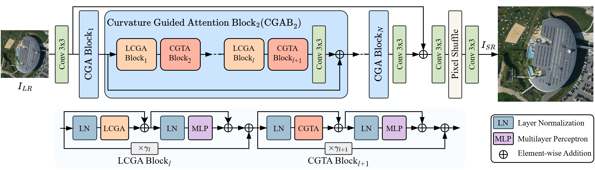
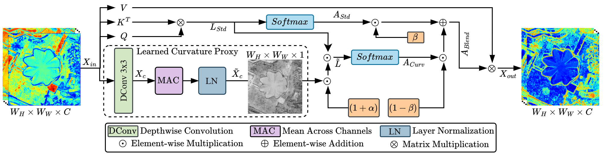
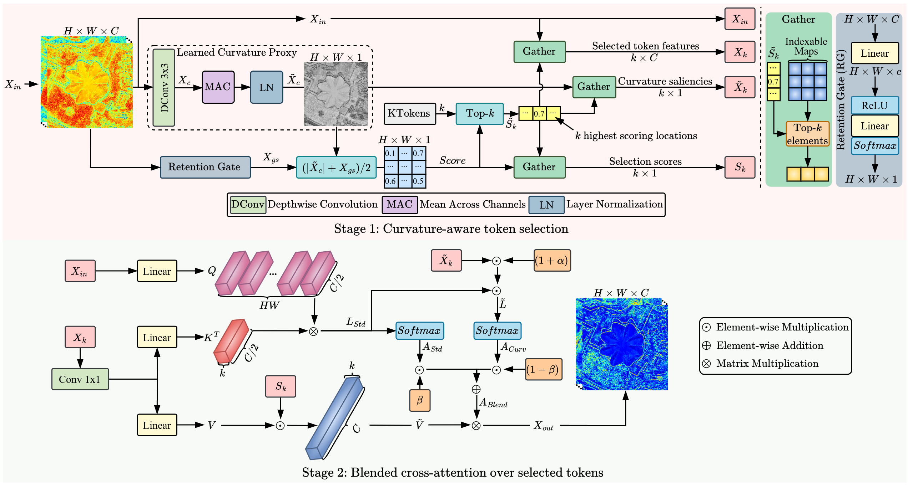

# CGA: Curvature-Guided Attention for Remote Sensing Image Super-Resolution

Muhammad Waleed Aslam, Sami Ul Rehman, Abu Muaz Muhammad Tayyab, Muhammad Hamza, Xinwei Li, and Yao Li, "CGA: Curvature-Guided Attention for Remote Sensing Image Super-Resolution", IEEE Transcations on Geoscience and Remote Sensing, 2026

[](https://ieeexplore.ieee.org/document/11373098) [](https://drive.google.com/drive/folders/1MOkyxsck9ETROtlFvInDqTvRJYaGyZ7h?usp=sharing)


---

> **Abstract:** Remote sensing (RS) image super-resolution (SR) supports downstream tasks in mapping, monitoring, and recognition, yet curvilinear structures and repetitive textures that encode scene topology are aliased by downsampling. Generic attention without geometric priors tends to yield jagged edges and washed-out detail. To address this, we present Curvature-Guided Attention (CGA), which injects curvature cues into local windowed attention and token-based global aggregation within a standard transformer framework. A local curvature-guided attention (LCGA) reinforces edge and line continuity inside windows, while a curvature-guided token attention (CGTA) selects globally informative tokens with near linear complexity, avoiding heavyweight global modules and extra branches. The resulting design preserves structural layout and texture regularity without degrading natural regions, and integrates with conventional residual groups. Across datasets and scale factors, CGA attains higher reconstruction fidelity than state-of-the-art SR models, with qualitative results showing clearer geometry and fewer artifacts. Ablations isolate the role of each component and confirm complementary benefits, and an efficiency-oriented variant retains the main trend under tighter memory and latency. We further validate CGA on real-world RS imagery without simulated degradation. These findings indicate that curvature guidance is an effective and practical inductive bias for RS image SR, strengthening both aggregate and class-level performance across scenes and scales while keeping computational complexity tractable.





---

## ⚙️ Dependencies
- Python 3.9
- PyTorch 2.5.0
- NVIDIA GPU + [CUDA](https://developer.nvidia.com/cuda-downloads)

```bash
# Clone the github repo and go to the default directory 'CGA'.
git clone https://github.com/mwaleedaslam/CGA.git
conda create -n CGA python=3.9
conda activate CGA
pip install -r requirements.txt -f https://download.pytorch.org/whl/torch_stable.html
python setup.py develop
```

## 🔗 Contents

1. [Datasets](#datasets)
1. [Models](#models)
1. [Training](#training)
1. [Testing](#testing)
1. [Citation](#citation)
1. [Acknowledgements](#acknowledgements)

---

## <a name="datasets"></a>🖨️ Datasets

Used training and testing sets can be downloaded as follows:
and AID dataset [[Baidu Drive](https://pan.baidu.com/s/1Cf-J_YdcCB2avPEUZNBoCA),password:id1n] [[Google Drive](https://drive.google.com/file/d/1d_Wq_U8DW-dOC3etvF4bbbWMOEqtZwF7/view)]

| Training Set                                                 |                         Testing Set                          |
| :----------------------------------------------------------- | :----------------------------------------------------------: | 
| AID dataset[[Baidu Drive](https://pan.baidu.com/s/1Cf-J_YdcCB2avPEUZNBoCA),password:id1n] [[Google Drive](https://drive.google.com/file/d/1d_Wq_U8DW-dOC3etvF4bbbWMOEqtZwF7/view)] (7850 training images, 150 validation images) | AID [[Baidu Drive](https://pan.baidu.com/s/1Cf-J_YdcCB2avPEUZNBoCA),password:id1n] [[Google Drive](https://drive.google.com/file/d/1d_Wq_U8DW-dOC3etvF4bbbWMOEqtZwF7/view)] (2000 images) + UCMerced [[Baidu Drive](https://pan.baidu.com/s/1ijFUcLozP2wiHg14VBFYWw),password:terr][[Google Drive](https://drive.google.com/file/d/12pmtffUEAhbEAIn_pit8FxwcdNk4Bgjg/view)] (1050 images) + WHU-RS19 [[Baidu Drive](https://pan.baidu.com/s/1hGMCXBxi9AVx4sacB06KQQ),password:ol6j] (1002 images) |

Download training and testing datasets and put them into the corresponding folders of `datasets/`. See [datasets](datasets/README.md) for the detail of the directory structure.

## <a name="models"></a>📦 Models

| Method | Params (M) | FLOPs (G) | PSNR (dB) |  SSIM  |                          Model Zoo                           |
| :----- | :--------: | :-------: | :-------: |:----------------------------------------------------------: | :----------------------------------------------------------: |
| CGA  |   10.47    |  48.15   |   29.7757   | 0.8073 | [Google Drive](https://drive.google.com/drive/folders/1MOkyxsck9ETROtlFvInDqTvRJYaGyZ7h?usp=sharing) |


The performance is reported on UCMerced (x4). Output size of FLOPs is 3×256×256.

## <a name="training"></a>🔧 Training

- Download dataset (AID) for training and validation, place them in `datasets/`.

- Run the following scripts. The training configuration is in `options/train/`.

  ```shell
  # CGA, input=64x64, 1 GPU
  python basicsr/train.py -opt options/train/train_CGA_x2.yml
  python basicsr/train.py -opt options/train/train_CGA_x4.yml
  
  # CGAL, input=64x64, 1 GPU
  python basicsr/train.py -opt options/train/train_CGA_L_x2.yml
  python basicsr/train.py -opt options/train/train_CGA_L_x4.yml
  ```

- The training experiment is in `experiments/`.


## <a name="testing"></a>🔨 Testing

### 🌗 Test images with HR

- Download the pre-trained [models](https://drive.google.com/drive/folders/1MOkyxsck9ETROtlFvInDqTvRJYaGyZ7h?usp=sharing) and place them in `experiments/pretrained_models/`.

  We provide pre-trained models for image SR: CGA (x2, x4).

- Download testing (AID, UCMerced, WHU-RS19) datasets, place them in `datasets/`.

- Run the following scripts. The testing configuration is in `options/test/` (e.g., [test_CGA_x2.yml](options/test/test_CGA_x2.yml)).

  Note 1:  You can set `use_chop: True` (default: False) in YML to chop the image for testing.

  ```shell
  python basicsr/test.py -opt options/test/test_CGA_x2.yml
  python basicsr/test.py -opt options/test/test_CGA_x4.yml
  
  python basicsr/test.py -opt options/test/test_CGA_L_x2.yml
  python basicsr/test.py -opt options/test/test_CGA_L_x4.yml
  ```
- The output is in `results/`.

## <a name="citation"></a>📎 Citation

If you find the code helpful in your research or work, please cite the following paper(s).

```
@article{waleed2026cga,
  author={Aslam, Muhammad Waleed and Rehman, Sami Ul and Tayyab, Abu Muaz Muhammad and Hamza, Muhammad and Li, Xinwei and Li, Yao},
  journal={IEEE Transactions on Geoscience and Remote Sensing}, 
  title={CGA: Curvature-Guided Attention for Remote Sensing Image Super-Resolution}, 
  year={2026},
  pages={1-14},
}
```


## <a name="acknowledgements"></a>💡 Acknowledgements

This code is built on [BasicSR](https://github.com/XPixelGroup/BasicSR) and [RGT](https://github.com/zhengchen1999/RGT). We thank the authors for sharing the codes.

